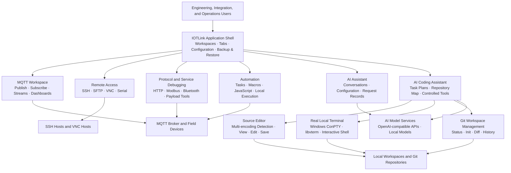

# IOTLink Product Description

## 1. Product Overview

**IOTLink** is a desktop engineering workstation for IoT connectivity, MQTT debugging, remote operations, protocol testing, automation, and AI-assisted development. It brings commonly separated tools into one workspace so engineers can configure connections, inspect data, run remote operations, edit project files, and manage repeatable tasks without constantly switching applications.

The product is designed for Windows-based development, commissioning, integration, and operations scenarios where MQTT, serial devices, SSH hosts, VNC sessions, HTTP services, Modbus devices, scripts, and local project files need to be handled together.

## 2. Architecture Diagram

The diagram below shows the high-level relationship between the IOTLink application shell, engineering tools, AI collaboration capabilities, and managed resources.

A Mermaid version is also included for Markdown platforms that support Mermaid rendering and further editing:

## 3. Target Users

- IoT platform and edge-device engineers
- MQTT integration and commissioning engineers
- Industrial automation and protocol-test engineers
- Remote operations and technical-support teams
- Developers working with local source repositories and AI-assisted coding workflows

## 4. Core Value

| Value                    | Description                                                  |
| ------------------------ | ------------------------------------------------------------ |
| One workspace            | Manage connections, messaging, remote sessions, scripts, plans, and project files in one desktop application. |
| Faster troubleshooting   | Observe MQTT traffic, terminal output, protocol data, and task execution in the same context. |
| Reusable operations      | Save connection profiles, schemes, macros, publishing tasks, scripts, and workspace data for repeatable work. |
| Controlled AI assistance | Use AI coding workflows with task plans, workspace-scoped tools, evidence checks, and reviewable file changes. |
| Practical local tooling  | Work with SSH, VNC, serial ports, HTTP, Modbus, Git, source files, and a real local terminal from the same interface. |

## 5. Main Capabilities

### 4.1 MQTT Engineering Workspace

- Create and manage MQTT connection profiles, including broker address, authentication, TLS, and SSH tunnel settings.
- Publish messages with topic, QoS, retain flag, text payload, hexadecimal payload, notes, and JavaScript preprocessing.
- Subscribe to topic filters with `+` and `#` wildcards, inspect incoming messages, and filter received data.
- Build stream-transform rules that consume source topics, run JavaScript transformations, and forward results to target topics.
- Create periodic publishing tasks and manage them as reusable operational jobs.
- Display selected message data through live dashboards and configurable visual views.

### 4.2 Workspace, Scheme, and Session Management

- Open multiple workspaces through top-level tabs.
- Separate persistent connection profiles from runtime sessions and workspace tabs.
- Save and load schemes containing publishing, subscription, stream, task, and script configurations.
- Use free sessions for temporary work and profile-backed sessions for repeatable operations.
- Restore saved workspace data and maintain backup-friendly configuration storage.

### 4.3 Remote Access and Device Operations

- SSH remote management with terminal interaction, quick commands, macros, and SFTP file operations.
- VNC remote access for graphical remote-control scenarios.
- Serial debugging for direct device communication.
- SSH session macros for repeatable operations such as command sending, output waiting, retries, local execution, MQTT actions, SFTP transfers, and Excel-based data processing.

### 4.4 Protocol and Service Debugging

IOTLink includes modular tooling for common integration work:

- HTTP debugging
- Modbus and virtual Modbus testing
- Bluetooth debugging
- Serial communication debugging
- MQTT batch operations
- Payload encoding and decoding
- Hexadecimal viewing and editing
- Stream transformation and system scripting

### 4.5 AI Assistant and AI Coding Assistant

The product includes an AI assistant for product-level interaction and an AI coding assistant for controlled workspace development.

The AI coding assistant supports:

- OpenAI-compatible chat-completions providers and optional local-model service integration.
- Task-oriented conversations with an execution plan that can reflect completion, blocked states, and verification status.
- Workspace-scoped file operations and repository mapping.
- Evidence-oriented checks and atomic multi-file editing workflows.
- Source browsing, file editing, saving, encoding selection, and Git actions from the workspace tree.
- A persistent Windows ConPTY terminal session for interactive command-line work, including retained shell state, working directory, environment variables, and interactive program state.

## 6. Source Editor and Local Terminal

### Source Editor

The built-in source editor is intentionally workspace-scoped. It supports browsing files through a directory tree, opening common source and configuration files, editing content, and saving changes safely within the selected workspace.

Supported text encodings include:

- UTF-8
- UTF-8 with BOM
- GB18030
- GBK
- UTF-16 LE
- UTF-16 BE
- System-default encoding

The editor can detect common encodings when opening a file and lets the user choose the output encoding when saving.

### Real Terminal

The local terminal is based on a persistent Windows ConPTY session rather than launching a separate process for every command. This allows normal shell behavior, including:

- Direct keyboard input
- Persistent `cd` state
- Persistent environment variables
- Tab completion and arrow-key navigation
- Interactive command-line applications
- Clipboard paste and interrupt handling
- Terminal resizing synchronized with the visible terminal grid

## 7. Git Support in the Workspace Tree

Directory nodes in the source tree provide Git-oriented actions for project-level work, including:

- Repository status inspection
- Repository initialization
- Diff viewing
- Commit-history viewing

These actions are executed through the local terminal context so developers can keep Git operations aligned with the active workspace.

## 8. Automation and Scriptability

IOTLink supports reusable automation through JavaScript system scripts, publishing tasks, stream rules, SSH macros, and local execution steps. Depending on the selected function, a workflow can combine MQTT messaging, terminal commands, SSH operations, SFTP transfers, conditional waits, JavaScript logic, and spreadsheet data processing.

This makes the product suitable for repeated commissioning procedures, test sequences, device-data checks, and operational playbooks.

## 9. Security and Operational Controls

- Connection profiles and workspace contexts are separated to reduce accidental cross-environment actions.
- AI coding operations are designed around workspace boundaries, repository maps, controlled tool calls, evidence checks, and reviewable changes.
- SSH, VNC, serial, and local-terminal functions should be used with the organization’s normal access-control, credential-management, and network-security requirements.
- Backup and restore workflows should be used for configuration and workspace continuity; production credentials and sensitive project content should be protected according to internal policy.

## 10. Typical Use Cases

1. **MQTT device commissioning** — connect to a broker, publish control messages, subscribe to device telemetry, and save the setup as a reusable scheme.
2. **Remote device maintenance** — use SSH terminal, SFTP, macros, and quick commands to inspect and update remote equipment.
3. **Protocol integration testing** — combine HTTP, Modbus, serial, Bluetooth, and MQTT tools in one workspace.
4. **Operational automation** — run scheduled publishing tasks, stream transformations, and repeatable macro procedures.
5. **AI-assisted project work** — inspect a source tree, edit files with encoding control, run commands in a real terminal, review Git status, and track a task plan.

## 11. Technical Positioning

IOTLink is built as a modular Qt desktop application. The AI coding module targets a Qt 5.14-compatible Windows toolchain and uses C++17. The architecture separates feature modules such as MQTT, SSH, VNC, serial debugging, protocol tooling, local models, AI coding, and the application shell, enabling product functions to evolve without coupling all capabilities into a single feature area.
