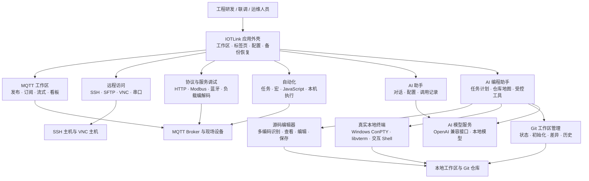

# IOTLink (山榕智能助手）产品说明

## 1. 产品概述

**IOTLink** 是面向物联网工程场景的桌面工作台，集成 MQTT 调试、远程运维、协议测试、自动化任务和 AI 辅助编程能力。产品将原本分散在多个工具中的连接配置、数据观察、终端操作、文件编辑、脚本处理和任务执行集中到同一工作区，减少工程人员在不同软件之间切换的成本。

IOTLink 适用于 Windows 环境下的研发、联调、设备调试、项目实施和运维支持场景，可协同处理 MQTT、串口设备、SSH 主机、VNC 会话、HTTP 服务、Modbus 设备、脚本和本地项目文件。

## 2. 产品架构图

下图展示 IOTLink 的应用外壳、工程工具、AI 协作能力与受管资源之间的总体关系。

同时提供 Mermaid 版本，便于在支持 Mermaid 的 Markdown 平台中继续编辑：

## 3. 目标用户

- 物联网平台及边缘设备研发人员
- MQTT 集成、联调和实施工程师
- 工业自动化与协议测试工程师
- 远程运维和技术支持团队
- 需要使用本地代码仓库和 AI 编程能力的开发人员

## 4. 核心价值

| 价值           | 说明                                                         |
| -------------- | ------------------------------------------------------------ |
| 一体化工作区   | 在一个桌面应用中集中管理连接、消息、远程会话、脚本、方案、任务和项目文件。 |
| 提升排障效率   | MQTT 消息、终端输出、协议数据和任务执行状态可在同一上下文中查看。 |
| 沉淀可复用流程 | 连接配置、方案、宏、发布任务、脚本和工作区数据可以保存复用。 |
| 可控 AI 协作   | AI 编程按任务计划、工作区边界、证据校验和可审阅文件变更执行。 |
| 面向工程实践   | 将 SSH、VNC、串口、HTTP、Modbus、Git、源码文件和真实本地终端统一到同一界面。 |

## 5. 主要功能

### 4.1 MQTT 工程工作区

- 创建和管理 MQTT 连接配置，包括 Broker 地址、认证、TLS 和 SSH 隧道参数。
- 按 Topic、QoS、保留标识发布消息，支持文本负载、十六进制负载、备注和 JavaScript 预处理。
- 使用 `+`、`#` 通配符订阅主题，查看和筛选接收消息。
- 配置流式转换规则：订阅源 Topic、执行 JavaScript 转换并转发到目标 Topic。
- 创建周期发布任务，将常用操作沉淀为可复用任务。
- 基于订阅数据展示实时看板、统计信息或图表视图。

### 4.2 工作区、方案和会话管理

- 通过顶部标签页同时打开多个工作区。
- 区分持久化连接配置、运行时会话和工作区标签，避免混淆。
- 保存和加载方案；方案可包含发布、订阅、流式、任务和脚本等配置。
- 使用自由会话处理临时工作，使用绑定连接配置的会话处理长期或重复操作。
- 支持工作区数据恢复以及面向配置连续性的备份机制。

### 4.3 远程访问与设备操作

- SSH 远程管理：终端交互、快捷命令、会话宏和 SFTP 文件操作。
- VNC 远程访问：适用于图形化远程控制场景。
- 串口调试：用于设备直接通信和现场联调。
- SSH 会话宏：可组合命令发送、输出等待、重试、本机程序执行、MQTT 操作、SFTP 传输和 Excel 数据处理等步骤。

### 4.4 协议与服务调试

IOTLink 通过模块化工具覆盖常见集成调试工作：

- HTTP 调试
- Modbus 与虚拟 Modbus 测试
- 蓝牙调试
- 串口通信调试
- MQTT 批量操作
- 负载编解码
- 十六进制查看与编辑
- 流式转换与系统脚本

### 4.5 AI 助手与 AI 编程助手

产品同时提供面向产品交互的 AI 助手，以及面向受控工作区开发的 AI 编程助手。

AI 编程助手支持：

- 对接 OpenAI 兼容 Chat Completions 服务，并可选用本地模型服务。
- 以任务为中心进行对话，显示执行计划、完成状态、阻塞状态和验证状态。
- 基于工作区范围的文件操作和代码仓库地图。
- 证据导向的检查机制，以及原子化的多文件修改流程。
- 通过目录树浏览源码、编辑与保存文件、选择编码，并在目录节点执行 Git 操作。
- 使用持久 Windows ConPTY 真实终端，保留 Shell 状态、工作目录、环境变量和交互程序状态。

## 6. 源码编辑与本地终端

### 源码编辑

内置源码编辑器限定在当前工作区范围内使用，可通过目录树浏览文件，打开常见源码和配置文件，编辑内容并安全保存到当前工作区。

支持的文本编码包括：

- UTF-8
- UTF-8 BOM
- GB18030
- GBK
- UTF-16 LE
- UTF-16 BE
- 系统默认编码

打开文件时可识别常见编码；保存文件时可通过编码选择项指定写回编码。

### 真实终端

本地终端基于持久 Windows ConPTY 会话实现，不是“每执行一条命令就启动一个新进程”的模拟控制台，因此可获得正常 Shell 使用体验，包括：

- 直接键盘输入
- 保持 `cd` 工作目录状态
- 保持环境变量状态
- Tab 补全和方向键导航
- 交互式命令行程序
- 剪贴板粘贴和中断控制
- 根据可见终端栅格同步调整终端尺寸

## 7. 目录树 Git 管理

源码目录树中的目录节点提供面向项目的 Git 操作，包括：

- 查看仓库状态
- 初始化 Git 仓库
- 查看差异
- 查看提交历史

Git 操作通过本地终端上下文执行，使 Git 命令与当前工作区保持一致。

## 8. 自动化与脚本能力

IOTLink 支持通过 JavaScript 系统脚本、发布任务、流式规则、SSH 宏和本机执行步骤构建可复用自动化流程。根据所选功能，一个流程可以组合 MQTT 消息、终端命令、SSH 操作、SFTP 传输、条件等待、JavaScript 逻辑和表格数据处理。

产品适合用于重复性设备投运、测试步骤执行、设备数据核验和运维操作编排。

## 9. 安全与运行控制

- 连接配置与工作区上下文分离，降低跨环境误操作风险。
- AI 编程围绕工作区边界、仓库地图、受控工具调用、证据校验和可审阅变更设计。
- SSH、VNC、串口和本地终端应配合组织现有的访问控制、凭据管理和网络安全制度使用。
- 建议使用备份与恢复机制保障配置和工作区连续性；生产凭据和敏感项目内容应按内部安全规范保护。

## 10. 典型应用场景

1. **MQTT 设备联调**：连接 Broker，发布控制指令，订阅设备遥测数据，并将配置保存为可复用方案。
2. **远程设备运维**：使用 SSH 终端、SFTP、宏和快捷命令检查或维护远端设备。
3. **协议集成测试**：在同一工作区组合 HTTP、Modbus、串口、蓝牙和 MQTT 调试能力。
4. **运维流程自动化**：执行定时发布任务、流式转换和可重复的宏操作。
5. **AI 辅助项目开发**：浏览源码树，按指定编码编辑文件，在真实终端中执行命令，查看 Git 状态，并跟踪任务计划。

## 11. 技术定位

IOTLink 采用模块化 Qt 桌面应用架构。AI 编程模块面向 Qt 5.14 兼容的 Windows 工具链，并使用 C++17。整体架构将 MQTT、SSH、VNC、串口调试、协议工具、本地模型、AI 编程和应用外壳拆分为独立功能模块，便于后续扩展与维护，避免所有功能耦合在单一模块中。
